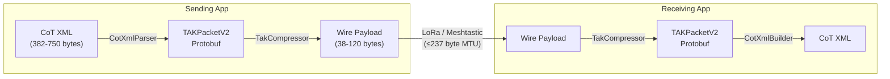
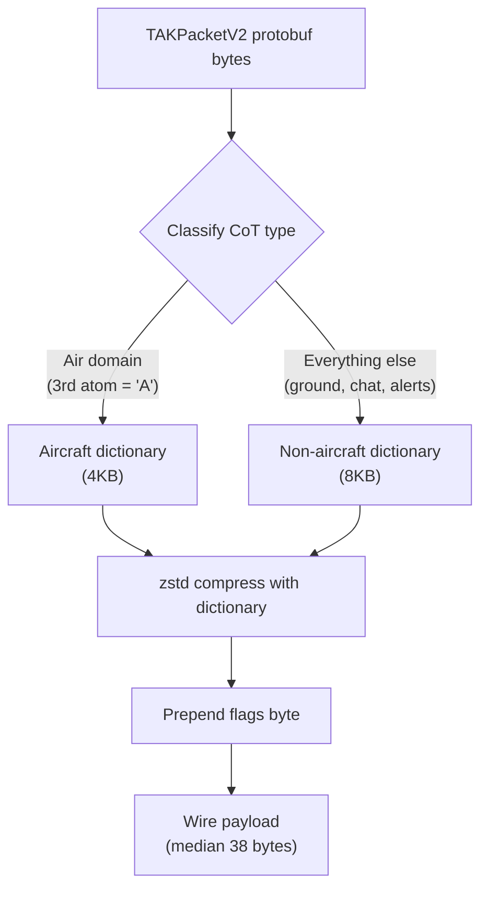

# TAKPacket-SDK

Shared libraries for converting ATAK Cursor-on-Target (CoT) XML to Meshtastic's TAKPacketV2 protobuf format and compressing it for LoRa transport using zstd dictionary compression.

This SDK is the single source of truth for CoT conversion and compression across all Meshtastic client platforms. Each language implementation produces byte-identical compressed payloads, validated by a shared set of cross-platform test vectors.

## Architecture



## How It Works

### 1. CoT XML Parsing

`CotXmlParser` extracts structured fields from a CoT XML event and maps them into a `TAKPacketV2` protobuf message. The parser handles all common CoT types including PLI (position), GeoChat, ADS-B aircraft tracks, CASEVAC, alerts, delete events, and more.

### 2. Compression Pipeline



Two pre-trained zstd dictionaries are used because aircraft and non-aircraft CoT messages have fundamentally different XML structures. Using the wrong dictionary degrades compression past the LoRa MTU. The dual-dictionary approach achieves **16x median compression** (600B XML to 38B wire payload).

### 3. Wire Format

```
+----------+-------------------------------------+
| Flags    | zstd-compressed TAKPacketV2 protobuf |
| (1 byte) | (N bytes)                            |
+----------+-------------------------------------+

Flags byte:
  bits 0-5: Dictionary ID
    0x00 = Non-aircraft (PLI, chat, ground, alerts, sensors)
    0x01 = Aircraft (ADS-B, military air tracks, helicopters)
    0x02-0x3E = Reserved for future dictionaries
  bits 6-7: Reserved/version

  Special value:
    0xFF = Uncompressed raw protobuf (sent by TAK_TRACKER firmware)
```

### 4. CoT XML Reconstruction

`CotXmlBuilder` reconstructs a standards-compliant CoT XML event from a `TAKPacketV2` protobuf, preserving all fields that were extracted during parsing.

## Wire Format Specification

See [WIRE_FORMAT.md](WIRE_FORMAT.md) for the complete wire format specification, including byte layout, flags byte structure, dictionary selection algorithm, error handling requirements, and annotated examples.

## Compression Results

See the auto-generated [Compression Report](testdata/compression-report.md) for current benchmark data. Updated on every merge to `main`.

## Supported Platforms

| Platform | Language | Directory | Status |
|----------|----------|-----------|--------|
| Android / ATAK Plugin | Kotlin | `kotlin/` | In Progress |
| iOS / macOS | Swift | `swift/` | Planned |
| Windows / .NET | C# | `csharp/` | Planned |
| Web / Node.js | TypeScript | `typescript/` | Planned |
| CLI / Scripting | Python | `python/` | Planned |

## Quick Start

### Kotlin
```kotlin
val parser = CotXmlParser()
val compressor = TakCompressor()

// Compress a CoT message for LoRa
val packet = parser.parse(cotXmlString)
val wirePayload = compressor.compress(packet)

// Decompress a received payload
val received = compressor.decompress(wirePayload)
val cotXml = CotXmlBuilder().build(received)
```

### Swift
```swift
let parser = CotXmlParser()
let compressor = TakCompressor()

// Compress
let packet = parser.parse(cotXmlString)
let wirePayload = try compressor.compress(packet)

// Decompress
let received = try compressor.decompress(wirePayload)
let cotXml = CotXmlBuilder().build(received)
```

### Python
```python
from meshtastic_tak import CotXmlParser, CotXmlBuilder, TakCompressor

parser = CotXmlParser()
compressor = TakCompressor()

# Compress
packet = parser.parse(cot_xml_string)
wire_payload = compressor.compress(packet)

# Decompress
received = compressor.decompress(wire_payload)
cot_xml = CotXmlBuilder().build(received)
```

### TypeScript
```typescript
import { parseCotXml, buildCotXml, TakCompressor } from "@meshtastic/takpacket-sdk";

const compressor = new TakCompressor();

// Compress
const packet = parseCotXml(cotXmlString);
const wirePayload = await compressor.compress(packet);

// Decompress
const received = await compressor.decompress(wirePayload);
const cotXml = buildCotXml(received);
```

### C#
```csharp
using Meshtastic.TAK;

var parser = new CotXmlParser();
var compressor = new TakCompressor();
var builder = new CotXmlBuilder();

// Compress
var packet = parser.Parse(cotXmlString);
var wirePayload = compressor.Compress(packet);

// Decompress
var received = compressor.Decompress(wirePayload);
var cotXml = builder.Build(received);
```

## API Reference

Each platform implements these four components with identical behavior:

| Class | Purpose |
|-------|---------|
| **CotXmlParser** | Parses CoT XML event string into a `TAKPacketV2` protobuf |
| **CotXmlBuilder** | Builds a CoT XML event string from a `TAKPacketV2` protobuf |
| **TakCompressor** | Compresses/decompresses `TAKPacketV2` using zstd dictionaries |
| **CotTypeMapper** | Maps CoT type strings to/from `CotType` enum values |

## Dictionary Management

- **Training**: Dictionaries are trained in the private [TAKPacket-ZTSD](https://github.com/meshtastic/TAKPacket-ZTSD) repository using real CoT XML corpora from TAK Server databases
- **Shipping**: Each platform embeds the dictionaries as binary resources (12KB total)
- **Versioning**: The flags byte supports up to 62 dictionary IDs, allowing new dictionaries to be added without breaking backward compatibility
- **Updates**: Retrained dictionaries are deployed via `TAKPacket-ZTSD/deploy.sh` and ship with SDK releases; old dictionary IDs remain valid

## Testing

All five language implementations share the same test vectors in `testdata/`:

- **`cot_xml/`** — Input CoT XML fixtures covering all major message types
- **`protobuf/`** — Expected TAKPacketV2 protobuf bytes (pre-compression)
- **`golden/`** — Expected compressed wire payloads (byte-for-byte identical across platforms)

Run tests for each platform:
```bash
cd kotlin && ./gradlew test
cd swift && swift test
cd csharp && dotnet test
cd typescript && npm test
cd python && pytest
```

Every test suite generates a `compression-report.md` documenting before/after payload sizes.

## License

GPL-3.0 — see [LICENSE](LICENSE) for details.
