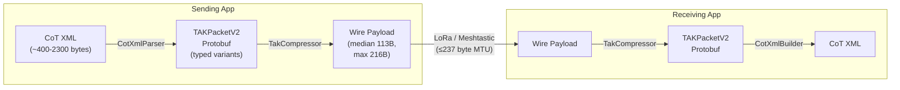
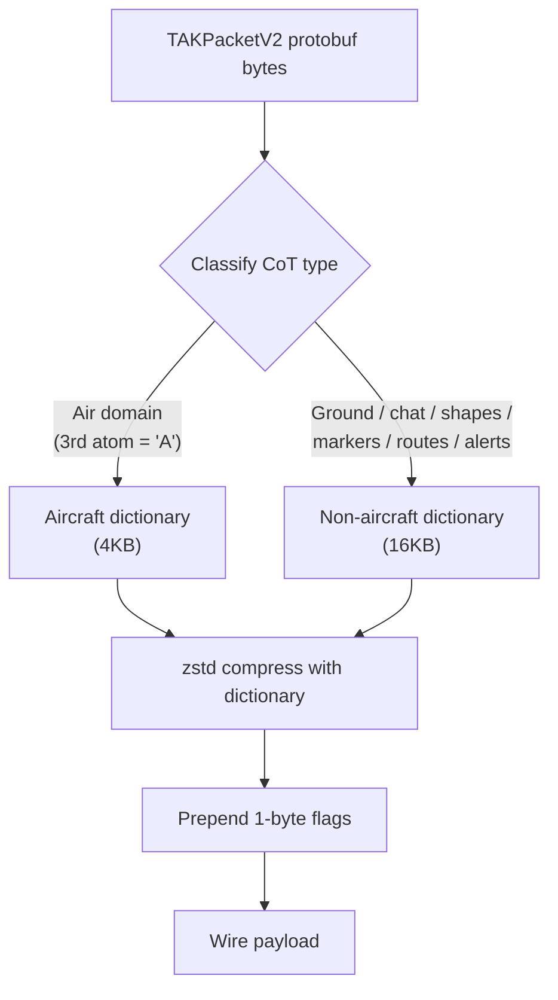

# TAKPacket-SDK

Shared libraries for converting ATAK Cursor-on-Target (CoT) XML to Meshtastic's TAKPacketV2 protobuf format and compressing it for LoRa transport using zstd dictionary compression.

This SDK is the single source of truth for CoT conversion and compression across all Meshtastic client platforms. Each language implementation produces interoperable compressed payloads, validated by 31 shared test fixtures and 868 cross-platform tests.

## Architecture



## How It Works

### 1. CoT XML Parsing

`CotXmlParser` extracts structured fields from a CoT XML event and maps them into a `TAKPacketV2` protobuf message. The parser recognizes all major CoT categories and decomposes each into a strongly-typed `payload_variant` case:

- **PLI** (position location info) — the default for ground units
- **GeoChat** — team chat with sender/recipient metadata, plus delivered/read receipts
- **Aircraft track** — ADS-B, military air tracks, with ICAO/reg/flight/category fields
- **Drawn shapes** — circles, rectangles, polygons, freeform polylines, telestrations, ranging circles, bullseyes, ellipses, 2D/3D vehicles
- **Markers** — spot, waypoint, checkpoint, self-position, 2525 symbols, spot maps, custom icons, mission points (GoTo / IP / CP / OP), image markers
- **Range-and-bearing lines** — anchor + range + bearing + stroke
- **Routes** — ordered waypoint + control point sequences with travel method and direction
- **CASEVAC reports** — 9-line MEDEVAC with precedence, patient counts, equipment / terrain bitfields, HLZ marking, security, comms frequency
- **Emergency alerts** — 911 / troops-in-contact / geo-fence breach / cancel with authoring and cancel-reference UIDs
- **Tasking requests** — engagement / observation / recon / rescue tasks with priority, status, target, assignee, and note
- **Delete events** — fall into the PLI envelope with the `t-x-d-d` CoT type string

When a detail element doesn't fit any typed variant, the SDK offers a `raw_detail` fallback via [Smart Compress Mode](#smart-compress-mode).

### 2. Compression Pipeline



Two pre-trained zstd dictionaries are used because aircraft and non-aircraft CoT messages have fundamentally different structural patterns. Using the wrong dictionary degrades compression past the LoRa MTU on the worst-case fixtures. On the bundled test set the pipeline achieves:

| Metric | Value |
|---|---|
| Total test messages | 31 |
| 100% under 237B LoRa MTU | ✅ YES |
| Median compressed size | **113B** |
| Median compression ratio | **5.4×** |
| Worst case | 216B (91% of LoRa MTU — `drawing_telestration`) |

See [`testdata/compression-report.md`](testdata/compression-report.md) for the per-fixture breakdown, regenerated on every Kotlin test run.

### 3. Wire Format

```
+----------+---------------------------------------------+
| Flags    | zstd-compressed TAKPacketV2 protobuf        |
| (1 byte) | (N bytes)                                   |
+----------+---------------------------------------------+

Flags byte:
  bits 0-5: Dictionary ID
    0x00 = Non-aircraft (PLI, chat, ground, shapes, markers,
                         routes, ranging, alerts)
    0x01 = Aircraft (ADS-B, military air tracks, helicopters)
    0x02-0x3E = Reserved for future dictionaries
  bits 6-7: Reserved / version

  Special value:
    0xFF = Uncompressed raw protobuf (sent by TAK_TRACKER firmware)
```

See [`WIRE_FORMAT.md`](WIRE_FORMAT.md) for the full specification including error handling requirements and annotated examples.

### 4. CoT XML Reconstruction

`CotXmlBuilder` reconstructs a standards-compliant CoT XML event from a `TAKPacketV2` protobuf, preserving every structured field extracted during parsing — including geometry vertices, stroke/fill colors, marker iconsets, and route waypoints.

## Structured Payload Types

`TAKPacketV2.payload_variant` is a proto `oneof` with eleven strongly-typed cases rather than a single opaque bytes field. Decomposing the `<detail>` element into structured messages gives three concrete benefits:

1. **Tighter compression** — repeated field names collapse to varint tags. A circle that takes 930B of XML fits in 128B on the wire (7.3× ratio); a 9-line MEDEVAC goes from 808B of XML to 99B (8.2× ratio).
2. **Schema evolution** — adding a field to `DrawnShape` doesn't break older receivers, they just see an unknown varint and skip it.
3. **Parse-side validation** — geometry is a structured object, not a regex over XML text.

| Tag | Variant | Proto message | CoT type atoms | Contents |
|---|---|---|---|---|
| 30 | `pli` | `bool` | `a-f-G-U-C`, `a-f-G-U-C-I`, … | Default ground-unit position |
| 31 | `chat` | `GeoChat` | `b-t-f`, `b-t-f-d`, `b-t-f-r` | Team chat message (plus delivered/read receipts via new fields) |
| 32 | `aircraft` | `AircraftTrack` | `a-n-A-C-F`, `a-h-A-M-F-F`, … | ADS-B / military air track |
| 33 | `raw_detail` | `bytes` | *any* | Smart-compress fallback (see below) |
| 34 | `shape` | `DrawnShape` | `u-d-c-c`, `u-d-r`, `u-d-f`, `u-d-f-m`, `u-d-p`, `u-r-b-c-c`, `u-r-b-bullseye`, `u-d-c-e`, `u-d-v`, `u-d-v-m` | Tactical graphics |
| 35 | `marker` | `Marker` | `b-m-p-s-m`, `b-m-p-w`, `b-m-p-c`, `a-u-G`, `b-m-p-w-GOTO`, `b-m-p-c-ip`, `b-m-p-c-cp`, `b-m-p-s-p-op`, `b-i-x-i`, … | Fixed markers, 2525 symbols, icons, mission points |
| 36 | `rab` | `RangeAndBearing` | `u-rb-a` | Range-and-bearing measurement |
| 37 | `route` | `Route` | `b-m-r` | Waypoint + control point sequence |
| 38 | `casevac` | `CasevacReport` | `b-r-f-h-c` | 9-line MEDEVAC request |
| 39 | `emergency` | `EmergencyAlert` | `b-a-o-tbl`, `b-a-o-pan`, `b-a-o-opn`, `b-a-g`, `b-a-o-c`, `b-a-o-can` | Emergency / 911 alert |
| 40 | `task` | `TaskRequest` | `t-s` | Tasking / engagement request |

Every geometry variant uses **delta-encoded** `CotGeoPoint` vertices (`sint32` offsets from the event anchor) so a 32-vertex telestration clustered inside 100m encodes in ~60 bytes of vertex data instead of ~320 bytes with absolute coordinates. Color fields use a two-field encoding: a `Team` palette enum for the 14 ATAK-standard colors (2 bytes on the wire) plus a `fixed32 _argb` fallback for custom user-picked colors (5 bytes). Round-trip is byte-exact — custom colors are never quantized to the nearest palette entry.

### DrawnShape (tag 34)

Covers ten tactical graphic kinds. The shape's anchor point lives on `TAKPacketV2.latitude_i`/`longitude_i`; geometry vertices are in a repeated `CotGeoPoint` field delta-encoded from that anchor.

| Kind value | Name | Wire fields used |
|---|---|---|
| 1 | `Circle` | `major_cm`, `minor_cm`, `angle_deg` |
| 2 | `Rectangle` | 4 vertices (corner points) |
| 3 | `Freeform` | N vertices (polyline) |
| 4 | `Telestration` | N vertices (may truncate at 32, sets `truncated=true`) |
| 5 | `Polygon` | N vertices (implicitly closed) |
| 6 | `RangingCircle` | `major_cm`, `minor_cm`, `angle_deg`, stroke only |
| 7 | `Bullseye` | Ellipse + `bullseye_distance_dm`, `bullseye_bearing_ref`, `bullseye_flags`, `bullseye_uid_ref` |
| 8 | `Ellipse` | `major_cm`, `minor_cm`, `angle_deg` (distinct major/minor, not a circle) |
| 9 | `Vehicle2D` | N vertices (footprint polygon) |
| 10 | `Vehicle3D` | N vertices (footprint polygon; receiver extrudes) |

`StyleMode` discriminates `StrokeOnly` vs `FillOnly` vs `StrokeAndFill`, preserving the distinction between *"this polyline has no fill"* and *"this shape has a transparent black fill"*.

**KML Style Links:** Circle and ellipse shapes include a `<link type="b-x-KmlStyle">` element inside `<shape>` for iTAK compatibility. ATAK encodes colors in KML's **ABGR hex format** (not ARGB). The builder converts `stroke_argb`/`fill_argb` proto fields (ARGB int32) to ABGR hex strings automatically:

| Proto field (ARGB) | KML hex (ABGR) | Example |
|---|---|---|
| `0xFFFF0000` (opaque red) | `ff0000ff` | `<color>ff0000ff</color>` |
| `0x9F00FF00` (semi-transparent green) | `9f00ff00` | `<color>9f00ff00</color>` |
| `0x00000000` (transparent) | not emitted | PolyStyle omitted |

**Kotlin — parse a drawing_circle and read its structured fields:**
```kotlin
val parser = CotXmlParser()
val packet = parser.parse(drawingCircleXml)
val shape = packet.payload as TakPacketV2Data.Payload.DrawnShape

println("Kind: ${shape.kind}")                              // 1 = Circle
println("Radius: ${shape.majorCm / 100.0} meters")          // e.g. 226.98
println("Stroke ARGB: #%08X".format(shape.strokeArgb))      // e.g. #FFFFFFFF
println("Style: ${shape.style}")                            // 3 = StrokeAndFill
println("Labels on: ${shape.labelsOn}")
```

**Swift — extract a polygon's vertices:**
```swift
let packet = parser.parse(drawingPolygonXml)
if case .shape(let shape) = packet.payloadVariant,
   shape.kind == .polygon {
    for vertex in shape.vertices {
        // CotGeoPoint is delta-encoded from the event anchor.
        let lat = Double(packet.latitudeI + vertex.latDeltaI) / 1e7
        let lon = Double(packet.longitudeI + vertex.lonDeltaI) / 1e7
        print("  (\(lat), \(lon))")
    }
}
```

### Marker (tag 35)

Fixed markers with a `Kind` enum covering the common ATAK categories plus the mission-point set that ATAK CIV added in 4.x (GoTo / Initial Point / Contact Point / Observation Post) and standalone image markers. `iconset` holds the full iconset path verbatim (no prefix stripping) — round-trip works for `COT_MAPPING_SPOTMAP/…`, `COT_MAPPING_2525B/…`, and custom `UUID/group/icon.png` paths.

| Kind value | Name | Typical CoT type |
|---|---|---|
| 1 | `Spot` | `b-m-p-s-m` |
| 2 | `Waypoint` | `b-m-p-w` |
| 3 | `Checkpoint` | `b-m-p-c` |
| 4 | `SelfPosition` | `b-m-p-s-p-i`, `b-m-p-s-p-loc` |
| 5 | `Symbol2525` | `a-*-G` with `iconsetpath="COT_MAPPING_2525B/…"` |
| 6 | `SpotMap` | `iconsetpath="COT_MAPPING_SPOTMAP/…"` |
| 7 | `CustomIcon` | Any type with a `UUID/group/icon.png` iconset |
| 8 | `GoToPoint` | `b-m-p-w-GOTO` |
| 9 | `InitialPoint` | `b-m-p-c-ip` |
| 10 | `ContactPoint` | `b-m-p-c-cp` |
| 11 | `ObservationPost` | `b-m-p-s-p-op` |
| 12 | `ImageMarker` | `b-i-x-i` |

**Python — classify a marker by kind:**
```python
packet = parser.parse(marker_2525_xml)
if packet.HasField("marker"):
    marker = packet.marker
    print(f"Kind: {marker.kind}")              # 5 = Symbol2525
    print(f"Iconset: {marker.iconset}")        # "COT_MAPPING_2525B/a-u/a-u-G"
    print(f"Parent UID: {marker.parent_uid}")
    print(f"Readiness: {marker.readiness}")
```

### RangeAndBearing (tag 36)

Single-leg range-and-bearing line. The anchor endpoint is a `CotGeoPoint` delta-encoded from the event point, so an anchor identical to the event (common for self-anchored RAB) encodes in zero bytes.

**TypeScript — extract range, bearing, and reconstruct the anchor:**
```typescript
import { parseCotXml } from "@meshtastic/takpacket-sdk";

const packet = parseCotXml(rangingLineXml);
if (packet.rab) {
  const rab = packet.rab as any;
  const rangeM = rab.rangeCm / 100;
  const bearingDeg = rab.bearingCdeg / 100;
  const anchorLat = (packet.latitudeI + (rab.anchor?.latDeltaI ?? 0)) / 1e7;
  const anchorLon = (packet.longitudeI + (rab.anchor?.lonDeltaI ?? 0)) / 1e7;
  console.log(`Range: ${rangeM} m @ ${bearingDeg}°`);
  console.log(`Anchor: ${anchorLat.toFixed(6)}, ${anchorLon.toFixed(6)}`);
}
```

### Route (tag 37)

Ordered waypoint sequence with travel method and direction. Link count caps at 16 — longer routes are truncated and the `truncated` flag is set.

| Field | Values |
|---|---|
| `method` | `Driving`, `Walking`, `Flying`, `Swimming`, `Watercraft` |
| `direction` | `Infil`, `Exfil` |
| `prefix` | Short waypoint prefix (e.g. `"CP"`, `"RP"`) |
| `links[]` | Up to 16 waypoint/checkpoint entries, each with delta-encoded point, uid, callsign, and `link_type` (0=waypoint, 1=checkpoint) |

**C# — iterate a route's waypoints:**
```csharp
var packet = parser.Parse(route3wpXml);
if (packet.PayloadVariantCase == TAKPacketV2.PayloadVariantOneofCase.Route)
{
    var route = packet.Route;
    Console.WriteLine($"Method: {route.Method}, Direction: {route.Direction}");
    foreach (var link in route.Links)
    {
        var lat = (packet.LatitudeI + link.Point.LatDeltaI) / 1e7;
        var lon = (packet.LongitudeI + link.Point.LonDeltaI) / 1e7;
        var kind = link.LinkType == 1 ? "checkpoint" : "waypoint";
        Console.WriteLine($"  {link.Callsign} ({kind}): {lat:F6}, {lon:F6}");
    }
}
```

### CasevacReport (tag 38)

9-line MEDEVAC request for CoT type `b-r-f-h-c`. Mirrors ATAK's MedLine `<_medevac_>` detail element: precedence, equipment flags bitfield, patient counts, HLZ marking method, zone marker, security at PZ, nationality counts, terrain obstacles bitfield, and comms frequency. Every field is optional so senders omit lines they don't have. The envelope carries Line 1 (location) and Line 2 (callsign).

| Enum | Values |
|---|---|
| `Precedence` | `Urgent` (A), `UrgentSurgical` (B), `Priority` (C), `Routine` (D), `Convenience` (E) |
| `HlzMarking` | `Panels`, `PyroSignal`, `Smoke`, `None`, `Other` |
| `Security` | `NoEnemy` (N), `PossibleEnemy` (P), `EnemyInArea` (E), `EnemyInArmedContact` (X) |

| Bitfield | Bit layout |
|---|---|
| `equipment_flags` | 0=none, 1=hoist, 2=extraction, 3=ventilator, 4=blood |
| `terrain_flags` | 0=slope, 1=rough, 2=loose, 3=trees, 4=wires, 5=other |

Typical wire size is ~65B of proto + envelope, compressing to ~99B — well under the 237B LoRa MTU even with all 9 lines populated.

**Kotlin — build a CASEVAC request:**
```kotlin
val packet = TakPacketV2Data(
    cotTypeId = CotTypeMapper.typeToEnum("b-r-f-h-c"),
    how = CotTypeMapper.howToEnum("h-g-i-g-o"),
    callsign = "MEDEVAC-1",
    uid = "medevac-01",
    latitudeI = (18.1 * 1e7).roundToInt(),
    longitudeI = (140.1 * 1e7).roundToInt(),
    payload = TakPacketV2Data.Payload.CasevacReport(
        precedence = CotXmlParser.PRECEDENCE_URGENT,
        litterPatients = 2,
        ambulatoryPatients = 1,
        equipmentFlags = 0x02 or 0x04,       // hoist + extraction
        security = CotXmlParser.SECURITY_POSSIBLE_ENEMY,
        hlzMarking = CotXmlParser.HLZ_MARKING_SMOKE,
        zoneMarker = "Green smoke",
        frequency = "38.90",
    ),
)
val wire = TakCompressor().compress(packet)  // ~99B, well under LoRa MTU
```

### EmergencyAlert (tag 39)

Small, high-priority structured record for emergency CoT types (`b-a-o-*`, `b-a-g`). The CoT type string is still set on `cot_type_id` so receivers that don't handle `payload_variant` can still display the alert; the typed fields let modern receivers show the authoring unit and handle cancel referencing without XML parsing.

| Enum | Value | CoT type |
|---|---|---|
| `Type_Alert911` | 1 | `b-a-o-tbl` |
| `Type_RingTheBell` | 2 | `b-a-o-pan` |
| `Type_InContact` | 3 | `b-a-o-opn` |
| `Type_GeoFenceBreached` | 4 | `b-a-g` |
| `Type_Custom` | 5 | `b-a-o-c` |
| `Type_Cancel` | 6 | `b-a-o-can` |

Typical self-authored alert compresses to ~87B on the wire. Cancel events reference the original alert UID via `cancel_reference_uid`.

**Swift — read an emergency alert:**
```swift
let packet = parser.parse(emergency911Xml)
if case .emergency(let emergency) = packet.payloadVariant {
    switch emergency.type {
    case .alert911:
        print("911 alert from \(emergency.authoringUid)")
    case .inContact:
        print("Troops in contact from \(emergency.authoringUid)")
    case .cancel:
        print("Cancel for \(emergency.cancelReferenceUid)")
    default:
        print("Emergency type: \(emergency.type)")
    }
}
```

### TaskRequest (tag 40)

Structured tasking record for CoT type `t-s`. Captures the target UID, assignee, priority, status, and a short note — everything the raw-detail fallback loses when flattening a task into remarks text. The envelope carries the requester UID (implicit) and creation time.

| Enum | Values |
|---|---|
| `Priority` | `Low`, `Normal`, `High`, `Critical` |
| `Status` | `Pending`, `Acknowledged`, `InProgress`, `Completed`, `Cancelled` |

The `task_type` field is free-text (capped at 12 chars) to avoid proto churn when ATAK adds new task categories — common values are `"engage"`, `"observe"`, `"recon"`, `"rescue"`.

**Python — inspect a task request:**
```python
packet = parser.parse(task_engage_xml)
if packet.HasField("task"):
    task = packet.task
    print(f"Task type: {task.task_type}")          # "engage"
    print(f"Target: {task.target_uid}")            # "target-01"
    print(f"Assigned to: {task.assignee_uid}")     # "ANDROID-..."
    print(f"Priority: {task.priority}")            # 3 = High
    print(f"Status: {task.status}")                # 1 = Pending
    print(f"Note: {task.note}")                    # "cover by fire"
```

### GeoChat receipts (tag 31, extended fields)

Delivered (`b-t-f-d`) and read (`b-t-f-r`) chat receipts ride on the same `chat = 31` slot as regular chat messages. The CoT type string on `cot_type_id` distinguishes delivered vs read at the envelope level; two new fields on `GeoChat` carry the referenced message UID so receivers can match the receipt back to the outbound message without XML parsing.

| Field | Values |
|---|---|
| `receipt_for_uid` | UID of the chat message being acknowledged |
| `receipt_type` | `None` (normal chat), `Delivered` (`b-t-f-d`), `Read` (`b-t-f-r`) |

**TypeScript — handle an incoming chat or receipt:**
```typescript
import { parseCotXml } from "@meshtastic/takpacket-sdk";

const packet = parseCotXml(incomingXml);
if (packet.chat) {
  const chat = packet.chat as any;
  if (chat.receiptType === 1) {
    console.log(`Delivered receipt for message ${chat.receiptForUid}`);
  } else if (chat.receiptType === 2) {
    console.log(`Read receipt for message ${chat.receiptForUid}`);
  } else {
    console.log(`Message from ${chat.toCallsign}: ${chat.message}`);
  }
}
```

### Color encoding with AtakPalette

Every color field in `DrawnShape`, `Marker`, and `RangeAndBearing` uses two parallel fields:

- A `Team` enum for the 14 ATAK palette colors (White, Yellow, Orange, Magenta, Red, Maroon, Purple, Dark Blue, Blue, Cyan, Teal, Green, Dark Green, Brown) — encodes in **2 bytes** on the wire
- A `fixed32 _argb` fallback for custom user-picked colors — encodes in **5 bytes**

The `AtakPalette` helper (shipped in every SDK) does the bidirectional lookup: `argbToTeam(0xFFFFFFFF)` returns `Team.White`, `teamToArgb(Team.Red)` returns `0xFFFF0000`. The parser sets both fields so receivers can pick whichever one suits them; the builder uses the palette's canonical ARGB when the team enum is set, otherwise the raw fallback bits so custom colors round-trip byte-for-byte.

## Smart Compress Mode

The default `compress()` path always serializes to the typed payload variant. For CoT types where the parser captures all detail elements structurally, this produces the smallest wire payload.

For edge cases — unknown CoT types, shapes with geometry beyond `MAX_VERTICES=32`, or any detail content the parser can't decompose — the SDK also provides a `compressBestOf()` method that:

1. Parses the XML into a typed `TAKPacketV2` (the normal path)
2. *Also* extracts the raw `<detail>` element bytes
3. Builds an alternative packet with the detail bytes stored in `payload_variant.raw_detail` (tag 33) and the detail-derived top-level fields cleared so nothing is shipped twice
4. Compresses *both* packets under the same zstd dictionary
5. Returns whichever wire payload is smaller (ties go to the typed packet)

The `raw_detail` fallback loses the structural benefits (no typed validation, no delta compression for vertices) but can beat the typed path for types the parser decomposes poorly.

**Kotlin:**
```kotlin
val parser = CotXmlParser()
val compressor = TakCompressor()

val packet = parser.parse(xml)
val rawDetail = parser.extractRawDetailBytes(xml)
val wire = compressor.compressBestOf(packet, rawDetail)
```

**Swift:**
```swift
let parser = CotXmlParser()
let compressor = TakCompressor()

let packet = parser.parse(xml)
let rawDetail = parser.extractRawDetailBytes(xml)
let wire = try compressor.compressBestOf(packet, rawDetailBytes: rawDetail)
```

**Python:**
```python
from meshtastic_tak import CotXmlParser, TakCompressor

parser = CotXmlParser()
compressor = TakCompressor()

packet = parser.parse(xml)
raw_detail = parser.extract_raw_detail_bytes(xml)
wire = compressor.compress_best_of(packet, raw_detail)
```

**TypeScript:**
```typescript
import { parseCotXml, extractRawDetailBytes, TakCompressor } from "@meshtastic/takpacket-sdk";

const compressor = new TakCompressor();
const packet = parseCotXml(xml);
const rawDetail = extractRawDetailBytes(xml);
const wire = await compressor.compressBestOf(packet, rawDetail);
```

**C#:**
```csharp
using Meshtastic.TAK;

var parser = new CotXmlParser();
var compressor = new TakCompressor();

var packet = parser.Parse(xml);
var rawDetail = CotXmlParser.ExtractRawDetailBytes(xml);
var wire = compressor.CompressBestOf(packet, rawDetail);
```

On the 31 bundled fixtures `compressBestOf()` picks the typed variant 100% of the time — the delta-encoded geometry wins on every known type. The fallback path is an insurance policy for unmapped types and oversize shapes, not a hot path.

## Real-World Compression Examples

End-to-end walkthroughs showing actual CoT XML from ATAK/iTAK being compressed for LoRa mesh transmission. Each example shows the raw XML, what gets stripped before compression, the resulting proto structure, and the final compressed wire payload. The LoRa MTU limit is **225 bytes**.

### PLI — Position Report (`a-f-G-U-C`)

**Raw CoT XML from TAK client** (754 bytes)
```xml
<event version="2.0" uid="ANDROID-0000000000000002" type="a-f-G-U-C" how="h-e"
       time="2026-03-15T15:30:00Z" start="2026-03-15T15:30:00Z" stale="2026-03-15T15:30:45Z">
  <point lat="12.00000" lon="91.00000" hae="-29.667" ce="32.2" le="9999999"/>
  <detail>
    <takv os="34" version="4.12.0.1 (00000000)[playstore].0000000000-CIV"
          device="Simulator" platform="ATAK-CIV"/>
    <contact endpoint="*:-1:stcp" phone="+15550000001" callsign="TESTNODE-01"/>
    <uid Droid="TESTNODE-01"/>
    <precisionlocation altsrc="GPS" geopointsrc="GPS"/>
    <__group role="Team Member" name="Cyan"/>
    <status battery="88"/>
    <track course="142.75" speed="1.2"/>
    <_flow-tags_ TAK-Server-00000000="2026-03-15T15:30:00Z"/>
  </detail>
</event>
```

**After stripping** (~400 bytes) — `<takv>`, `<precisionlocation>`, `<_flow-tags_>` removed
```xml
<event version="2.0" uid="ANDROID-0000000000000002" type="a-f-G-U-C" how="h-e"
       time="2026-03-15T15:30:00Z" start="2026-03-15T15:30:00Z" stale="2026-03-15T15:30:45Z">
  <point lat="12.00000" lon="91.00000" hae="-29.667" ce="32.2" le="9999999"/>
  <detail>
    <contact endpoint="*:-1:stcp" phone="+15550000001" callsign="TESTNODE-01"/>
    <uid Droid="TESTNODE-01"/>
    <__group role="Team Member" name="Cyan"/>
    <status battery="88"/>
    <track course="142.75" speed="1.2"/>
  </detail>
</event>
```

**TAKPacketV2 proto fields**
```
cot_type_id: 1 (a-f-G-U-C)    how: 1 (h-e)
callsign: "TESTNODE-01"        device_callsign: "TESTNODE-01"
latitude_i: 120000000          longitude_i: 910000000
altitude: -30                  speed: 120 (cm/s)      course: 14275 (deg×100)
battery: 88                    team: 5 (Cyan)          role: 1 (TeamMember)
geo_src: 1 (GPS)               alt_src: 1 (GPS)
endpoint: "" (normalized)       phone: "+15550000001"
pli: true
```

| Stage | Size | Reduction |
|-------|------|-----------|
| Raw XML | 754 B | — |
| Stripped | ~400 B | -47% |
| Compressed | **151 B** | **80% total** |

---

### GeoChat — Broadcast Message (`b-t-f`)

**Raw CoT XML from iTAK** (1031 bytes)
```xml
<event version="2.0" uid="GeoChat.23131970-4D02-4092-A30A-8A49EBD04AA0.All Chat Rooms.08C6FA28"
       type="b-t-f" how="h-g-i-g-o" time="2026-04-10T13:41:23Z" ...>
  <point lat="34.80545694681502" lon="-92.4817947769074" hae="9999999.0" .../>
  <detail>
    <__chat parent="RootContactGroup" groupOwner="false" messageId="08C6FA28"
            chatroom="All Chat Rooms" id="All Chat Rooms" senderCallsign="iPad">
      <chatgrp uid0="23131970-4D02-4092-A30A-8A49EBD04AA0" uid1="All Chat Rooms"/>
    </__chat>
    <link uid="23131970-4D02-4092-A30A-8A49EBD04AA0" type="a-f-G-E-V-C" relation="p-p"/>
    <remarks source="BAO.F.ATAK.23131970-..." to="All Chat Rooms" time="...">Test</remarks>
    <__serverdestination destinations="*:4242:tcp:23131970-..."/>
    <_flow-tags_ TAK-Server-dd4055d1="2026-04-10T13:41:23Z"/>
  </detail>
</event>
```

**TAKPacketV2 proto fields** — `chat.to` omitted for broadcast (saves 16 bytes)
```
cot_type_id: 25 (b-t-f)       how: 3 (h-g-i-g-o)
callsign: "iPad"               uid: "GeoChat.23131970-...All Chat Rooms.08C6FA28"
chat {
  message: "Test"
  to_callsign: "iPad"          # to: null (broadcast = 0 bytes)
}
```

| Stage | Size | Reduction |
|-------|------|-----------|
| Raw XML | 1,031 B | — |
| Stripped | ~700 B | -32% |
| Compressed | **80 B** | **92% total** |

---

### Rectangle — Drawn Shape (`u-d-r`)

**Raw CoT XML from ATAK** (945 bytes)
```xml
<event version="2.0" uid="ace0fc3f-9587-406c-be66-a52f02cdbedf" type="u-d-r"
       time="2026-04-11T01:09:56.557Z" stale="2026-04-12T01:09:56.557Z" how="h-e">
  <point lat="34.8044064" lon="-92.436114" hae="67.004" .../>
  <detail>
    <link point="34.80564553084199,-92.43683293800487"/>
    <link point="34.80422710311164,-92.43446184473841"/>
    <link point="34.80316693332748,-92.43539543971937"/>
    <link point="34.80458597608953,-92.43776596177908"/>
    <__shapeExtras cpvis="false" editable="true"/>
    <remarks/>
    <creator uid="ANDROID-2fb24d79bf83a660" callsign="ETHEL" .../>
    <strokeColor value="-16777089"/>
    <strokeWeight value="3.0"/>
    <strokeStyle value="solid"/>
    <fillColor value="-1778384769"/>
    <contact callsign="Rectangle 2"/>
    <tog enabled="0"/>
    <precisionlocation altsrc="SRTM1" geopointsrc="USER"/>
    <labels_on value="false"/>
    <archive/>
  </detail>
</event>
```

**After stripping** (~500 bytes) — `<__shapeExtras>`, `<creator>`, `<tog>`, `<archive>`, `<remarks/>`, `<strokeStyle>`, `<precisionlocation>` removed
```xml
<event version="2.0" uid="ace0fc3f-..." type="u-d-r" ...>
  <point lat="34.8044064" lon="-92.436114" hae="67.004" .../>
  <detail>
    <link point="34.80564553084199,-92.43683293800487"/>
    <link point="34.80422710311164,-92.43446184473841"/>
    <link point="34.80316693332748,-92.43539543971937"/>
    <link point="34.80458597608953,-92.43776596177908"/>
    <strokeColor value="-16777089"/>
    <strokeWeight value="3.0"/>
    <fillColor value="-1778384769"/>
    <contact callsign="Rectangle 2"/>
    <labels_on value="false"/>
  </detail>
</event>
```

**TAKPacketV2 proto fields** — vertices delta-encoded from anchor point
```
cot_type_id: 40 (u-d-f/u-d-r)  how: 1 (h-e)
callsign: "Rectangle 2"
latitude_i: 348044064          longitude_i: -924361140
shape {
  kind: 2 (Rectangle)          style: 3 (StrokeAndFill)
  stroke_argb: 0xFF0000FF      fill_argb: 0x960000FF
  stroke_weight_x10: 30        labels_on: false
  vertices: [                  # delta-encoded from anchor
    { lat_delta_i: +1245, lon_delta_i: -7219 }
    { lat_delta_i: -1835, lon_delta_i: +1655 }
    { lat_delta_i: -2737, lon_delta_i: +719  }
    { lat_delta_i: -1527, lon_delta_i: -1559 }
  ]
}
```

| Stage | Size | Reduction |
|-------|------|-----------|
| Raw XML | 945 B | — |
| Stripped | ~500 B | -47% |
| Compressed | **101 B** | **87% total** |

---

### Circle — Drawn Shape (`u-d-c-c`)

**Raw CoT XML from ATAK** (851 bytes)
```xml
<event version="2.0" uid="67EBAF59-A216-4B0C-BD24-9AE5EE4D65E6" type="u-d-c-c" ...>
  <point lat="34.7720486" lon="-92.4584657" hae="9999999.0" .../>
  <detail>
    <shape>
      <ellipse major="393.14" minor="393.14" angle="360"/>
      <link uid="67EBAF59-...Style" type="b-x-KmlStyle" relation="p-c">
        <Style><LineStyle><color>ffff4245</color><width>3.0</width></LineStyle>
        <PolyStyle><color>00000000</color></PolyStyle></Style>
      </link>
    </shape>
    <__shapeExtras cpvis="true" editable="true"/>
    <strokeColor value="-48571"/>
    <strokeWeight value="3.0"/>
    <fillColor value="0"/>
    <contact callsign="Shape 324"/>
    <labels_on value="false"/>
    <archive/>
    <uid Droid="Shape 324"/>
  </detail>
</event>
```

**TAKPacketV2 proto fields** — circle stored as major/minor radii in centimeters
```
cot_type_id: 42 (u-d-c-c)     how: 1 (h-e)
callsign: "Shape 324"
latitude_i: 347720486          longitude_i: -924584657
shape {
  kind: 1 (Circle)             style: 1 (StrokeOnly)
  major_cm: 39314              minor_cm: 39314         angle_deg: 360
  stroke_argb: 0xFFFF4245      fill_argb: 0x00000000
  stroke_weight_x10: 30        labels_on: false
}
```

| Stage | Size | Reduction |
|-------|------|-----------|
| Raw XML | 851 B | — |
| Stripped | ~450 B | -47% |
| Compressed | **90 B** | **90% total** |

---

### Route — 3 Waypoints (`b-m-r`)

**Raw CoT XML from iTAK** (890 bytes)
```xml
<event version="2.0" uid="139A3009-681E-4B1A-8F23-DBB49A2C338D" type="b-m-r" ...>
  <point lat="34.74829435592147" lon="-92.43520215509216" hae="0.0" .../>
  <detail>
    <contact callsign="Route - 04/11 06:48:00"/>
    <precisionLocation geopointsrc="???" altsrc="???"/>
    <link uid="D71306C3-..." callsign="SP" type="b-m-p-w"
          point="34.74829435592147,-92.43520215509216"/>
    <link uid="06BDF9C8-..." callsign="" type="b-m-p-c"
          point="34.74650551240878,-92.43195557866541"/>
    <link uid="A5449578-..." callsign="VDO" type="b-m-p-w"
          point="34.748578593226505,-92.4354345620684"/>
    <link_attr color="-65281" method="Walking" prefix="CP" direction="Infil"
               routetype="Primary" order="Ascending Check Points"/>
    <marti/>
  </detail>
</event>
```

**After stripping** (~500 bytes) — `<precisionLocation>`, `<marti/>`, `???` attrs, `routetype`, `order`, `color`, empty `callsign` removed
```xml
<event version="2.0" uid="139A3009-..." type="b-m-r" ...>
  <point lat="34.74829435592147" lon="-92.43520215509216" hae="0.0" .../>
  <detail>
    <contact callsign="Route - 04/11 06:48:00"/>
    <link uid="D71306C3-..." callsign="SP" type="b-m-p-w"
          point="34.74829435592147,-92.43520215509216"/>
    <link uid="06BDF9C8-..." type="b-m-p-c"
          point="34.74650551240878,-92.43195557866541"/>
    <link uid="A5449578-..." callsign="VDO" type="b-m-p-w"
          point="34.748578593226505,-92.4354345620684"/>
    <link_attr method="Walking" prefix="CP" direction="Infil"/>
  </detail>
</event>
```

**TAKPacketV2 proto fields** — waypoints delta-encoded, method/direction as compact fields
```
cot_type_id: 10 (b-m-r)       how: 1 (h-e)
callsign: "Route - 04/11 06:48:00"
latitude_i: 347482943          longitude_i: -924352021
route {
  method: 1 (Walking)          direction: 1 (Infil)     prefix: "CP"
  stroke_weight_x10: 30
  links: [
    { lat_i: 347482943, lon_i: -924352021, uid: "D71306C3-...", callsign: "SP",  link_type: 0 }
    { lat_i: 347465055, lon_i: -924319555, uid: "06BDF9C8-...",                  link_type: 1 }
    { lat_i: 347485785, lon_i: -924354345, uid: "A5449578-...", callsign: "VDO", link_type: 0 }
  ]
}
```

| Stage | Size | Reduction |
|-------|------|-----------|
| Raw XML | 890 B | — |
| Stripped | ~500 B | -44% |
| Compressed | **116 B** | **87% total** |

> **Note:** Routes are the tightest fit under the 225B LoRa MTU. Each waypoint adds ~25-35 compressed bytes. The stripper removes `routetype`, `order`, `color`, and empty `callsign` attributes from `<link_attr>` and checkpoint links to save ~60+ bytes. Routes with 5+ waypoints may still exceed the limit — consider splitting into multiple route segments.

---

### Marker — Spot Map (`b-m-p-s-m`)

**Raw CoT XML from ATAK** (721 bytes)
```xml
<event version="2.0" uid="9405e320-9356-41c4-8449-f46990aa17f8" type="b-m-p-s-m"
       time="2026-03-15T14:22:10Z" stale="2026-03-16T14:22:10Z" how="h-g-i-g-o">
  <point lat="10.00606" lon="95.00362" hae="9999999.0" .../>
  <detail>
    <status readiness="true"/>
    <archive/>
    <link uid="ANDROID-0000000000000001" type="a-f-G-U-C"
          parent_callsign="SIM-01" relation="p-p"/>
    <contact callsign="R 1"/>
    <remarks/>
    <color argb="-65536"/>
    <precisionlocation altsrc="???"/>
    <usericon iconsetpath="COT_MAPPING_SPOTMAP/b-m-p-s-m/-65536"/>
  </detail>
</event>
```

**After stripping** (~400 bytes) — `<archive>`, `<remarks/>`, `<precisionlocation>`, `???` removed
```xml
<event version="2.0" uid="9405e320-..." type="b-m-p-s-m" ...>
  <point lat="10.00606" lon="95.00362" hae="9999999.0" .../>
  <detail>
    <status readiness="true"/>
    <link uid="ANDROID-0000000000000001" type="a-f-G-U-C"
          parent_callsign="SIM-01" relation="p-p"/>
    <contact callsign="R 1"/>
    <color argb="-65536"/>
    <usericon iconsetpath="COT_MAPPING_SPOTMAP/b-m-p-s-m/-65536"/>
  </detail>
</event>
```

**TAKPacketV2 proto fields** — kind derived from CoT type, color as palette enum
```
cot_type_id: 8 (b-m-p-s-m)    how: 3 (h-g-i-g-o)
callsign: "R 1"
latitude_i: 100060600          longitude_i: 950036200
marker {
  kind: 1 (Spot)               readiness: true
  color: 4 (Red)               color_argb: 0xFFFF0000
  parent_uid: "ANDROID-0000000000000001"
  parent_type: "a-f-G-U-C"
  parent_callsign: "SIM-01"
  iconset: "COT_MAPPING_SPOTMAP/b-m-p-s-m/-65536"
}
```

| Stage | Size | Reduction |
|-------|------|-----------|
| Raw XML | 721 B | — |
| Stripped | ~400 B | -44% |
| Compressed | **81 B** | **89% total** |

---

### Compression Summary

| Payload Type | Raw XML | Compressed | Ratio | Fits LoRa? |
|-------------|---------|------------|-------|------------|
| PLI (position) | 754 B | 151 B | 5.0x | ✅ |
| GeoChat (text) | 1,031 B | 80 B | 12.9x | ✅ |
| Rectangle (4 vertices) | 945 B | 101 B | 9.4x | ✅ |
| Circle (ellipse) | 851 B | 90 B | 9.5x | ✅ |
| Route (3 waypoints) | 890 B | 116 B | 7.7x | ✅ |
| Marker (spot) | 721 B | 81 B | 8.9x | ✅ |

Median compression ratio across all fixture types: **~8x** (400-2300 bytes XML → 56-211 bytes wire).

### Wire Optimizations

The SDK applies several optimizations to minimize wire payload size:

| Optimization | Savings | Description |
|-------------|---------|-------------|
| **Endpoint normalization** | ~20 B/msg | Default endpoints (`0.0.0.0:4242:tcp`, `*:-1:stcp`) normalized to empty; builder restores the default on reconstruction |
| **Broadcast sentinel** | ~16 B/chat | `chat.to = "All Chat Rooms"` normalized to null (proto field omitted) |
| **Element stripping** | ~100-200 B/msg | Non-essential XML elements (`<takv>`, `<voice>`, `<precisionLocation>`, `<__geofence>`, `<marti>`, `<__shapeExtras>`, `<creator>`, `<tog>`, `<archive>`, `<strokeStyle>`, empty `<remarks>`) stripped before SDK parsing |
| **Attribute stripping** | ~30-80 B/msg | Display-only attributes stripped: `routetype`, `order`, `color` (from `<link_attr>`), `access`, empty `callsign`/`phone`, and all `"???"` placeholder values |
| **Delta vertex encoding** | ~50% vs abs | Shape/route vertices stored as deltas from the event anchor point |
| **zstd dictionary v3** | ~5-8x | Dictionaries trained on 700 real-world protobuf samples covering all payload types |

**Stripped elements and attributes are not needed for rendering** — the SDK extracts all structurally meaningful data (coordinates, waypoints, colors, stroke weight, method, direction, prefix) into typed proto fields. The stripped metadata is display-only, UI-state, or redundant with proto fields.

## Supported Platforms

| Platform | Language | Directory | Tests |
|----------|----------|-----------|-------|
| Android / ATAK Plugin | Kotlin | `kotlin/` | ✅ 211 |
| iOS / macOS | Swift | `swift/` | ✅ 152 |
| Windows / .NET | C# | `csharp/` | ✅ 191 |
| Web / Node.js | TypeScript | `typescript/` | ✅ 161 |
| CLI / Scripting | Python | `python/` | ✅ 153 |

Every platform is byte-interoperable: `.pb` and `.bin` golden files written by Kotlin's `CompressionTest.generate compression report` are consumed by the other four platforms for exact-match validation (within protobuf field-order tolerance) and full round-trip equivalence.

## Quick Start

### Kotlin
```kotlin
val parser = CotXmlParser()
val compressor = TakCompressor()

// Compress a CoT message for LoRa
val packet = parser.parse(cotXmlString)
val wirePayload = compressor.compress(packet)

// Decompress a received payload
val received = compressor.decompress(wirePayload)
val cotXml = CotXmlBuilder().build(received)
```

### Swift
```swift
let parser = CotXmlParser()
let compressor = TakCompressor()

// Compress
let packet = parser.parse(cotXmlString)
let wirePayload = try compressor.compress(packet)

// Decompress
let received = try compressor.decompress(wirePayload)
let cotXml = CotXmlBuilder().build(received)
```

### Python
```python
from meshtastic_tak import CotXmlParser, CotXmlBuilder, TakCompressor

parser = CotXmlParser()
compressor = TakCompressor()

# Compress
packet = parser.parse(cot_xml_string)
wire_payload = compressor.compress(packet)

# Decompress
received = compressor.decompress(wire_payload)
cot_xml = CotXmlBuilder().build(received)
```

### TypeScript
```typescript
import { parseCotXml, buildCotXml, TakCompressor } from "@meshtastic/takpacket-sdk";

const compressor = new TakCompressor();

// Compress
const packet = parseCotXml(cotXmlString);
const wirePayload = await compressor.compress(packet);

// Decompress
const received = await compressor.decompress(wirePayload);
const cotXml = buildCotXml(received);
```

### C#
```csharp
using Meshtastic.TAK;

var parser = new CotXmlParser();
var compressor = new TakCompressor();
var builder = new CotXmlBuilder();

// Compress
var packet = parser.Parse(cotXmlString);
var wirePayload = compressor.Compress(packet);

// Decompress
var received = compressor.Decompress(wirePayload);
var cotXml = builder.Build(received);
```

## API Reference

Each platform implements the same components with identical behavior:

| Class | Purpose |
|-------|---------|
| **CotXmlParser** | Parses a CoT XML event string into a `TAKPacketV2` protobuf with the appropriate typed payload variant |
| **CotXmlBuilder** | Builds a CoT XML event string from a `TAKPacketV2` protobuf (handles every typed variant including `raw_detail`) |
| **TakCompressor** | Compresses/decompresses `TAKPacketV2` using zstd dictionaries, with both default `compress()` and opt-in `compressBestOf()` paths |
| **CotTypeMapper** | Maps CoT type strings to/from `CotType` enum values; classifies aircraft types for dictionary selection |
| **AtakPalette** | Bidirectional lookup between ATAK's 14-color palette and `Team` enum values, for color round-trip preservation |

## Dictionary Management

- **Training** — Dictionaries are trained in the private [TAKPacket-ZTSD](https://github.com/meshtastic/TAKPacket-ZTSD) repository using real CoT XML corpora from TAK Server databases, augmented with synthetic shape/marker/route/casevac/emergency/task samples for the typed-payload extensions.
- **Shipping** — Each platform embeds the dictionaries as binary resources: **16 KB** non-aircraft + **4 KB** aircraft = 20 KB total.
- **Versioning** — The flags byte supports up to 62 dictionary IDs, allowing new dictionaries to be added without breaking backward compatibility. The current dictionaries are **v2** — retrained on the expanded corpus for the CasevacReport / EmergencyAlert / TaskRequest / GeoChat-receipts rollout. Dictionary IDs stay at 0 (non-aircraft) / 1 (aircraft), so a pre-v2 receiver can still decode post-v2 wire payloads at the cost of a slightly worse ratio.
- **Updates** — Retrained dictionaries are deployed via `TAKPacket-ZTSD/deploy.sh` and ship with SDK releases; old dictionary IDs remain valid on the wire.

## Testing

All five language implementations share the same test vectors in `testdata/`:

- **`cot_xml/`** — 31 input CoT XML fixtures covering PLI, chat, aircraft, alerts, CASEVAC (bare + full 9-line), delete events, the full typed-geometry set (6 drawings including ellipse, 4 markers including GoTo and tank, 3 ranging, 1 waypoint, 1 route), emergency alerts (911 + cancel), tasking, and chat receipts (delivered + read). All coordinates are in synthetic test ranges over open ocean — no real user locations leak through the test corpus.
- **`protobuf/`** — Expected `TAKPacketV2` protobuf bytes (pre-compression), written by Kotlin's `CompressionTest`, consumed by every other platform for exact-match validation.
- **`golden/`** — Expected compressed wire payloads, byte-for-byte identical across platforms.

Run tests for each platform:
```bash
cd kotlin && ./gradlew test
cd swift && swift test
cd csharp && dotnet test
cd typescript && npm test
cd python && pytest
```

Or run all five at once:
```bash
./build.sh test
```

The Kotlin `CompressionTest.generate compression report` test regenerates `testdata/compression-report.md`, `testdata/protobuf/*.pb`, and `testdata/golden/*.bin` — it's the canonical fixture generator for the entire SDK.

## License

GPL-3.0 — see [LICENSE](LICENSE) for details.
